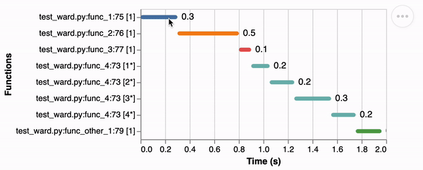

# Wards: A Simple python time profiler

Yet another Python library for function timing with interactive visualizations.

<p align="center">
  
</p>

# Usage
```python
    from ward import ward
    ward.remove()

    @ward.watchit
    def func_1():
        return sleep(0.3)

    @ward.watchit
    def func_2():
        return sleep(0.5)

    @ward.watchit
    def func_3():
        sl = [0.15, 0.20, 0.30, 0.2]
        for i in sl:
            func_4(i)

    func_1()
    func_2()
    func_3()
```

> [!WARNING]
> This software is unfinished. Keep your expectations low.


*Please, read [CONTRIBUTING.md](CONTRIBUTING.md) before making a PR.*
